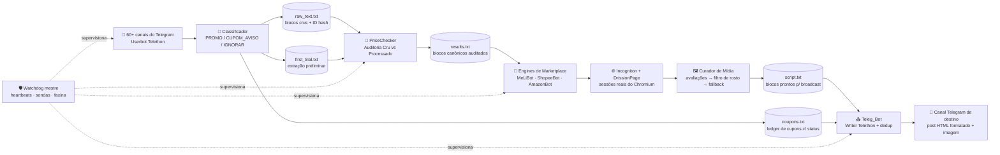
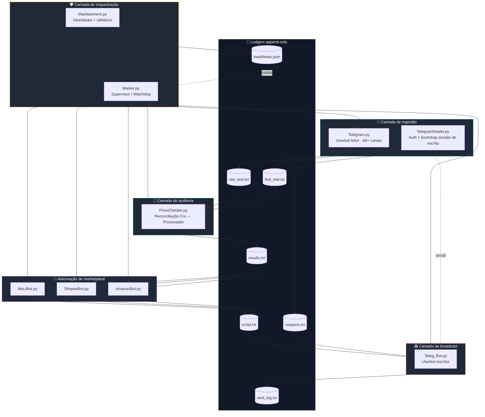

<div align="center">
<a href="./README.md">
  
</a>
<br />
<br />

<h3>🛰️ Uma plataforma 100% autônoma de mineração de ofertas — do ruído bruto à postagem formatada no Telegram</h3>
<p>
  <em>Ingestão no Telegram + auditoria de dados (raw vs. processado) + automação headless de marketplaces +<br/>
  curadoria de mídia com visão computacional consciente de privacidade + broadcast zero-touch.</em>
</p>
<br />
<p>
  
  
  
  
  
</p>
<p>
  
  
  
  
  
  
  
  
  
  
</p>
<br />
<table>
  <tr>
    <td align="center" width="25%">
      <h3>📡 Capta</h3>
      <sub>60+ canais do Telegram<br/>monitorados em tempo real</sub>
    </td>
    <td align="center" width="25%">
      <h3>🧮 Audita</h3>
      <sub>Reconciliação de blocos<br/>crus vs. processados</sub>
    </td>
    <td align="center" width="25%">
      <h3>🤖 Automatiza</h3>
      <sub>Extração headless<br/>ML / Shopee / Amazon</sub>
    </td>
    <td align="center" width="25%">
      <h3>📤 Divulga</h3>
      <sub>Disparo formatado<br/>e deduplicado</sub>
    </td>
  </tr>
</table>
</div>

---

> **Nota sobre este repositório.** Este é um **showcase público de portfólio** do projeto *Atlas das Promos*. O código-fonte é **proprietário e fechado**; este README existe para que recrutadores e clientes consigam auditar a profundidade de engenharia, as decisões arquiteturais e os subsistemas reais que rodam em produção. Nada aqui é discurso de marketing — toda afirmação mapeia para um módulo do código privado.

---

## 📑 Sumário
1. [Visão geral](#-visão-geral)
2. [Resumo de impacto](#-resumo-de-impacto)
3. [Pipeline do sistema](#-pipeline-do-sistema)
4. [Arquitetura](#-arquitetura)
5. [Destaques técnicos](#-destaques-técnicos)
6. [Stack técnica](#-stack-técnica)
7. [Demonstração do sistema](#-demonstração-do-sistema)
8. [Roadmap](#-roadmap)
9. [Sobre](#-sobre)
10. [Licença](#-licença)

---

## ✨ Visão geral

O **Atlas das Promos** é um pipeline ponta a ponta que transforma o fluxo ruidoso e desestruturado de canais brasileiros de promoções do Telegram em uma **única transmissão limpa e legível** — automaticamente, 24/7, sem curadoria manual.

O sistema escuta dezenas de canais públicos, *classifica* cada mensagem recebida (promoção de produto vs. aviso de cupom vs. ruído), normaliza e **audita** os dados contra o bloco bruto original, dirige **navegadores reais** através de perfis anti-detecção do Incogniton para extrair títulos, preços, imagens e links de afiliado verdadeiros do Mercado Livre, Shopee e Amazon, aplica um **filtro de visão computacional consciente de privacidade** para preservar apenas fotos de avaliação que não contenham rostos humanos e, finalmente, **publica uma mensagem formatada e deduplicada** no canal de destino do Telegram.

Tudo é supervisionado por um watchdog mestre que monitora portas de navegador, conectividade com a internet, heartbeats por bot e executa limpeza programada do data lake.

---

## 💥 Resumo de impacto

| Métrica | Resultado |
| :--- | :--- |
| Canais monitorados em paralelo | **60+** canais brasileiros via userbot MTProto |
| Intervenção manual necessária | **Zero** — totalmente autônomo após o boot |
| Marketplaces totalmente automatizados | **3** (Mercado Livre, Shopee, Amazon) com perfis anti-detecção |
| Camada de integridade de dados | Auditoria cruzada: todo bloco publicado é validado contra sua origem crua |
| Garantia de privacidade na mídia | **Haar Cascade do OpenCV** descarta qualquer foto de avaliação com rosto |
| Confiabilidade | Supervisor watchdog com sondas de heartbeat, checagem de portas, internet e auto-restart |

---

## 🧠 Pipeline do sistema



---

## 🏗️ Arquitetura

O sistema é decomposto em **sete processos independentes** orquestrados por um supervisor mestre. Cada processo tem uma única responsabilidade, se comunica via *ledgers* de texto append-only e emite heartbeats periódicos consumidos pelo watchdog.



### Responsabilidade processo a processo

| Processo | Função |
| :--- | :--- |
| **Master.py** | Menu de boot, faxina horária, loop de watchdog. Sonda as portas do Incogniton (9221/9222/9223), checa internet, reinicia bots mortos via process-groups do `subprocess`, dispara alertas no Telegram quando algum marketplace cai. |
| **Telegram.py** | Userbot Telethon (sessão de leitura). Assina 60+ canais, classifica cada mensagem (`PROMO` / `CUPOM_AVISO` / `IGNORAR`), expande URLs encurtadas com proteção contra páginas de challenge, deduplica combinações fuzzy de produto/preço/marketplace numa janela de 10h e persiste os blocos cru e processado lado a lado. |
| **PriceChecker.py** | Observer contínuo (Watchdog) que **audita** cada bloco processado contra sua origem crua usando um `ID` hash compartilhado, conserta preço e cupom e reescreve o bloco canônico em `results.txt`. |
| **MeLiBot / ShopeeBot / AmazonBot** | DrissionPage controla uma sessão real do Chromium acoplada a um perfil anti-detecção do Incogniton (portas 9221/9222/9223). Cada bot resolve a URL real do produto, faz scraping do título e preço canônicos, executa o **curador de mídia com detecção de rosto**, gera o link de afiliado e grava um bloco pronto para broadcast. |
| **Teleg_Bot.py** | Userbot Telethon (sessão de escrita). Monitora `script.txt` e `coupons.txt` incrementalmente, deduplica por SHA-256 + assinatura fuzzy 75%, baixa a imagem em memória forçando JPEG (impede o Telegram de converter WebP em sticker) e publica o post HTML no canal de destino. |
| **TelegramDealer.py** | Bootstrap isolado da conta escritora: valida `.env`, gerencia 2FA, recria DBs de sessão corrompidos. |
| **Maintainment.py** | Helpers compartilhados de heartbeat / persistência de hash e link consumidos por todos os workers. |

---

## 🧪 Destaques técnicos

### 1. Pipeline de ingestão e sondagem no Telegram

A camada de ingestão é um **userbot Telethon** (não uma conta de bot) conectado a uma whitelist curada de **60+ canais brasileiros de promoções**, distribuídos em várias categorias — livros, moda, eletrônicos, cozinha, só-cupons. Toda mensagem recebida é hashada (MD5 → ID de 8 chars) e roteada por um classificador multi-estágio:

- **PROMO** — qualquer mensagem com padrão de preço `R$` é tratada como oferta de produto.
- **CUPOM_AVISO** — qualquer mensagem sem preço mas com ~30 gatilhos de cupom (`CUPOM`, `OFF`, `DESCONTO`, `ESGOTADO`, `VOLTOU`, marcadores por emoji `🎟️ 🏷️ ✅`, etc.) vai para o ledger de cupons.
- **IGNORAR** — todo o resto.

Famílias de canais especiais (livros, "star", "clover") têm extratores estruturados próprios que parseiam linhas com prefixo de emoji (`📚 Nome`, `🛍 Preço`, `🔗 Link`) em dicionários tipados. URLs encurtadas são expandidas via `HEAD` com User-Agent desktop, mais uma **trava anti-página-de-bloqueio**: se a URL resolvida contiver `validate.perfdrive.com`, `captcha`, `shieldsquare` ou `challenge`, o sistema reverte para a URL encurtada original, evitando envenenar os consumidores downstream com uma parede de CAPTCHA.

### 2. Auditoria de dados cru vs. processado

Todo bloco do Telegram é persistido **duas vezes** — uma vez cru (em `raw_text.txt`) e uma vez após o extrator preliminar (`first_trial.txt`). O módulo `PriceChecker.py` é um observer contínuo do Watchdog que, a cada modificação de arquivo, relê ambos, indexa os blocos crus pelo `ID` hash e, para cada bloco processado:

- Reexecuta a extração de preço com regex mais estrita (rejeitando preço parcelado tipo `12x de R$ ...`).
- Compara o link cru **expandido** com o link processado expandido (UTM removido, domínio normalizado). Se divergirem, o link confiável substitui o duvidoso.
- Re-detecta o nome canônico do produto a partir do bloco cru, removendo emojis-prefixo de promoção (`🔥 🛍️ ✅ 🚨 💥 ➡️ 💻`).
- Cruza códigos de cupom contra `coupons.txt` e descarta o bloco se o cupom estiver marcado como `ESGOTADO`.

O bloco auditado é anexado a `results.txt`, que é a **fonte única de verdade** para a camada de automação. Essa camada de auditoria é o que garante integridade de preço mesmo quando o postador original do canal usou formatação fora do padrão.

### 3. Motor de automação dos marketplaces

Cada marketplace é dirigido por **DrissionPage acoplado a um perfil Chromium anti-detecção do Incogniton** rodando numa porta de debug local fixa (9221 = ML, 9222 = Shopee, 9223 = Amazon). O supervisor sonda essas portas a cada minuto e pausa os bots de marketplace se um perfil cair, mantendo a ingestão viva.

Cada bot:

1. Filtra os resultados auditados pelas URLs que ele "possui" (ex.: `mercadolivre.com`).
2. Carrega a página, simula scroll humano para acionar lazy-load.
3. Extrai o título canônico do DOM real (`h1.ui-pdp-title` no ML, etc.).
4. Executa o **curador de mídia com detecção de rosto** (abaixo).
5. Dirige o *próprio gerador de afiliados do marketplace* (textarea do Linkbuilder do Mercado Livre, SiteStripe da Amazon, encurtador da Shopee) para produzir uma URL rastreável e monetizável.
6. Compara o título scrapeado com o título reportado pelo canal usando `SequenceMatcher`; se a similaridade ficar abaixo de 0.75, confia no título scrapeado.
7. Anexa um bloco pronto para broadcast a `script.txt`.

Um registro de erros nomeados (`amz_err_001`, `ml_err_005`, `brw_err_006`, etc.) torna todo modo de falha grepável no log de auditoria.

### 4. Curador de mídia com filtro de privacidade por detecção de rostos

Esse é o subsistema mais distintivo.

Quando a página de um produto é aberta, o bot primeiro coleta **todas as imagens do carrossel de avaliações** (`ui-review-capability-carousel__img` no Mercado Livre, `.review-image-tile` na Amazon, equivalentes na Shopee). Fotos de avaliação são comercialmente poderosas — mostram o produto em contextos domésticos reais — mas também carregam um **risco de privacidade**: clientes ocasionalmente aparecem em suas próprias fotos.

Para cada imagem de avaliação candidata, o bot roda um **detector de rosto Haar Cascade do OpenCV** inline:

```python
faces = FACE_CASCADE.detectMultiScale(
    gray, scaleFactor=1.1, minNeighbors=7, minSize=(80, 80)
)
return len(faces) > 0
```

A cascata de curadoria é:

1. Iterar por cada imagem de avaliação.
2. Baixar via `httpx`, decodificar com OpenCV.
3. Se `possui_rosto()` retornar `True`, **descartar** e registrar `face_detected · ml_err_005`.
4. Escolher a **primeira imagem de avaliação sem rosto detectado** como mídia do post, marcada `image_origem = "review"` — que o broadcaster depois promove para a linha "✅ A imagem é de uma avaliação real!" no post final.
5. **Fallback** — se *todas* as imagens de avaliação forem rejeitadas (ou não houver nenhuma), o bot cai de volta para a imagem canônica do produto, scrapeada do container oficial do PDP.

Na prática, isso é um otimizador de qualidade de mídia que respeita privacidade: prefere conteúdo autêntico do usuário, mas nunca publica um rosto humano sem consentimento.

### 5. Broadcast formatado e deduplicado no Telegram

O `Teleg_Bot.py` roda uma segunda sessão Telethon (a conta *escritora*) e monitora `script.txt` e `coupons.txt` incrementalmente — rastreando offset de bytes por arquivo e tratando arquivo que diminui como sinal de reset. Novos blocos passam por uma **trava de deduplicação em três camadas**:

1. **Hash forte** — SHA-256 de `(texto + url_imagem)` checado contra um set em memória + o `sent_log.txt` persistente.
2. **Hash canônico do link** — MD5 da URL do produto limpa; rejeita ofertas republicadas onde só o wrapper mudou.
3. **Assinatura fuzzy** — `SequenceMatcher` sobre uma assinatura `nome + preço + cupom` contra os últimos 50 posts enviados; rejeita a partir de 75% de similaridade.

Posts são despachados por um **worker único de `asyncio.Queue`** com delay anti-spam configurável, e as imagens são baixadas para um `BytesIO` que é *renomeado para `imagem.jpg`* antes do upload — um truque deliberado que impede o Telegram de reinterpretar thumbs `.webp` de avaliações como stickers animados.

Avisos de cupom têm seu próprio formatador, que emite três layouts distintos (cupom único, vários cupons, cupom esgotado) com títulos por marketplace e seleção gramaticalmente correta do artigo em português (`do Mercado Livre` vs. `da Amazon`).

---

## 🧰 Stack técnica

<div align="center">

### Núcleo


### Telegram


### Automação de navegador


### Visão computacional


### Redes e I/O


### Config e tooling


</div>

---

## 📺 Demonstração do sistema

> O repositório é um **showcase fechado**, mas o sistema em produção é gravado ponta a ponta. Os espaços de vídeo abaixo hospedarão clipes curtos demonstrando cada subsistema ao vivo.

**Ingestão no Telegram e auditoria cru/processado:**

https://github.com/user-attachments/assets/d7c8081b-8d9e-47f9-9be9-6aedd71715d7


**Automação de marketplace + curadoria de mídia com filtro de rostos:**

<!-- Espaço para vídeo: scraping + filtro OpenCV -->
*(vídeo será embedado aqui)*

**Broadcast final formatado no canal de destino do Telegram:**

<!-- Espaço para vídeo: saída do broadcast -->
*(vídeo será embedado aqui)*

---

## 🗺️ Roadmap

| Marco | Status | Meta |
| :--- | :---: | :--- |
| Userbot leitor Telethon + ingestão de 60+ canais | ✅ Concluído | — |
| Classificador (PROMO / CUPOM_AVISO / IGNORAR) + trava anti-CAPTCHA na expansão | ✅ Concluído | — |
| Módulo de auditoria cru-vs-processado (PriceChecker) | ✅ Concluído | — |
| Engines DrissionPage + Incogniton (ML, Shopee, Amazon) | ✅ Concluído | — |
| Curador OpenCV com cascata avaliação→fallback | ✅ Concluído | — |
| Userbot escritor no Telegram com dedup em três camadas | ✅ Concluído | — |
| Watchdog mestre: sondas, heartbeats, faxina horária | ✅ Concluído | — |
| **Migrar o data lake de arquivos append-only para uma API REST** | 🟡 Em andamento | 3º tri / 2026 |
| **Disparo automático para WhatsApp (Business API + grupos)** | ⏳ Planejado | 4º tri / 2026 |
| Painel web para moderação ao vivo de ofertas | ⏳ Planejado | 2027 |
| Plug-ins multi-tenant de marketplaces (KaBuM, Magalu, AliExpress) | ⏳ Planejado | 2027 |

---

## 👤 Sobre

Este é um **projeto solo, pessoal e privado**, desenhado, arquitetado e construído ponta a ponta por **Gabriel Feltrin Emilio**. Não tem vínculo com nenhuma instituição. O repositório existe exclusivamente como vitrine pública de engenharia — o código-fonte permanece fechado.

---

## 📜 Licença

O código-fonte é **proprietário e não está licenciado para redistribuição**. Este README e os materiais de showcase que o acompanham são publicados sob a Licença MIT apenas para fins de referência.

---

<div align="center">

<sub>Construído de forma privada, ponta a ponta, por um único engenheiro — porque promoção de verdade merece engenharia de verdade.</sub>

<br /><br />

<a href="./README.md">
  
</a>

</div>
