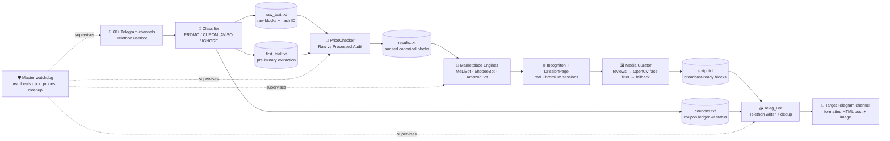
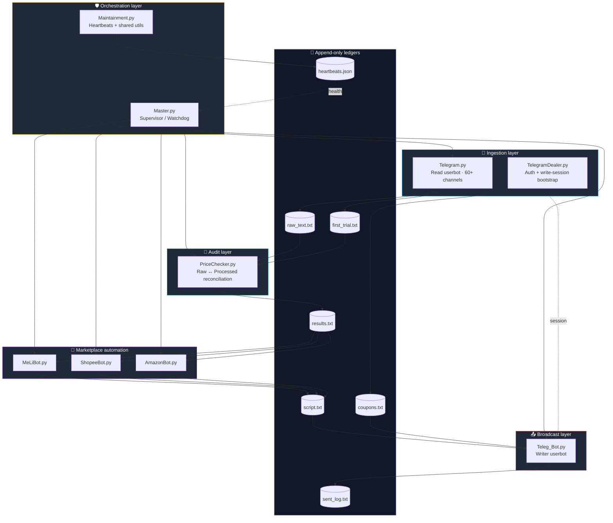

<div align="center">
<a href="./README-ptBR.md">
  
</a>
<br />
<br />

<h3>🛰️ A fully autonomous deal-mining platform — from raw chatter to a formatted Telegram broadcast</h3>
<p>
  <em>Telegram ingestion + raw-vs-processed data auditing + headless marketplace automation +<br/>
  privacy-aware computer-vision media curation + zero-touch broadcast.</em>
</p>
<br />
<p>
  
  
  
  
  
</p>
<p>
  
  
  
  
  
  
  
  
  
  
</p>
<br />
<table>
  <tr>
    <td align="center" width="25%">
      <h3>📡 Ingest</h3>
      <sub>60+ Telegram channels<br/>monitored in real time</sub>
    </td>
    <td align="center" width="25%">
      <h3>🧮 Audit</h3>
      <sub>Raw vs. processed<br/>block reconciliation</sub>
    </td>
    <td align="center" width="25%">
      <h3>🤖 Automate</h3>
      <sub>ML / Shopee / Amazon<br/>headless extraction</sub>
    </td>
    <td align="center" width="25%">
      <h3>📤 Broadcast</h3>
      <sub>Formatted, deduped<br/>Telegram dispatch</sub>
    </td>
  </tr>
</table>
</div>

---

> **Note on this repository.** This is a public **portfolio showcase** for the *Atlas das Promos* project. The source code is **proprietary and closed-source**; this README exists so recruiters and clients can audit the engineering depth, architectural decisions, and the real subsystems running in production. Nothing here is marketing copy — every claim maps to a module in the private codebase.

---

## 📑 Table of Contents
1. [Overview](#-overview)
2. [Impact summary](#-impact-summary)
3. [System pipeline](#-system-pipeline)
4. [Architecture](#-architecture)
5. [Technical highlights](#-technical-highlights)
6. [Tech stack](#-tech-stack)
7. [System demonstration](#-system-demonstration)
8. [Roadmap](#-roadmap)
9. [About](#-about)
10. [License](#-license)

---

## ✨ Overview

**Atlas das Promos** is an end-to-end pipeline that turns the noisy, unstructured firehose of Brazilian deal channels on Telegram into a single, clean, human-readable broadcast — automatically, 24/7, with zero manual curation.

The system listens to dozens of public channels, *classifies* every incoming message (product promo vs. coupon notice vs. noise), normalizes and **audits** the data against the original raw block, drives **real browsers** through Incogniton anti-detect profiles to extract genuine product titles, prices, images, and affiliate links from Mercado Livre, Shopee and Amazon, applies a **privacy-aware computer-vision filter** to preserve only review photos that do not contain human faces, and finally **posts a formatted, deduplicated message** to the destination Telegram channel.

Everything is supervised by a master watchdog that monitors browser ports, internet connectivity, per-bot heartbeats, and runs scheduled cleanup over the data lake.

---

## 💥 Impact summary

| Metric | Outcome |
| :--- | :--- |
| Channels monitored in parallel | **60+** Brazilian deal channels via MTProto userbot |
| Manual intervention required | **Zero** — fully autonomous after boot |
| Marketplaces fully automated | **3** (Mercado Livre, Shopee, Amazon) with anti-detect browser profiles |
| Data integrity layer | Cross-checked: every published block is audited against its raw origin |
| Privacy guarantee on media | **OpenCV Haar Cascade** discards any review photo containing a face |
| Reliability | Watchdog supervisor with heartbeat probes, port checks, internet checks and auto-restart |

---

## 🧠 System pipeline



---

## 🏗️ Architecture

The system is decomposed into **seven independent processes** orchestrated by a master supervisor. Each process owns one responsibility, communicates through append-only text ledgers, and emits periodic heartbeats consumed by the watchdog.



### Process-by-process responsibility

| Process | Role |
| :--- | :--- |
| **Master.py** | Boot menu, hourly cleanup window, watchdog loop. Probes Incogniton ports (9221/9222/9223), checks internet, restarts dead bots via subprocess process-groups, emits Telegram alerts when marketplaces go offline. |
| **Telegram.py** | Telethon read-session userbot. Subscribes to 60+ channels, classifies each message (`PROMO` / `CUPOM_AVISO` / `IGNORE`), expands shortened URLs while guarding against challenge pages, deduplicates fuzzy product/price/marketplace combos within a 10h window, and persists raw + processed blocks side by side. |
| **PriceChecker.py** | Continuous file-watcher (Watchdog) that **audits** every processed block against its raw origin using a shared `ID` hash, repairs prices and coupons, rewrites the canonical block in `results.txt`. |
| **MeLiBot / ShopeeBot / AmazonBot** | DrissionPage drives a real Chromium session attached to an Incogniton anti-detect profile (ports 9221/9222/9223). Each bot resolves the real product URL, scrapes the canonical title and price, runs the **face-aware media curator**, generates the affiliate link, and writes a broadcast-ready block. |
| **Teleg_Bot.py** | Telethon write-session userbot. Watches `script.txt` and `coupons.txt` incrementally, deduplicates by SHA-256 + 75% fuzzy signature, downloads the image into memory to force JPEG dispatch (preventing Telegram WebP→sticker conversion), and pushes the formatted HTML post to the destination channel. |
| **TelegramDealer.py** | Standalone bootstrap for the writer account: validates `.env`, manages 2FA, regenerates corrupted session DBs. |
| **Maintainment.py** | Shared heartbeat writer / hash and link persistence helpers consumed by every worker. |

---

## 🧪 Technical highlights

### 1. Telegram ingestion & probing pipeline

The ingestion layer is a Telethon **userbot** (not a bot account) connected to a curated whitelist of **60+ Brazilian deal channels** spread across multiple categories — books, fashion, electronics, kitchen, coupons-only. Every incoming message is hashed (MD5 → 8-char ID) and routed through a multi-stage classifier:

- **PROMO** — any message carrying a `R$` price pattern is treated as a product deal.
- **CUPOM_AVISO** — any message lacking a price but matching one of ~30 coupon triggers (`CUPOM`, `OFF`, `DESCONTO`, `ESGOTADO`, `VOLTOU`, emoji-based markers `🎟️ 🏷️ ✅`, etc.) is routed to the coupon ledger.
- **IGNORE** — everything else.

Special channel families (books, "star", "clover") get their own structured extractors that parse emoji-prefixed lines (`📚 Name`, `🛍 Price`, `🔗 Link`) into typed dictionaries. Shortened URLs are expanded through a `HEAD` request *with* a desktop User-Agent, plus a **block-page guard**: if the resolved URL contains `validate.perfdrive.com`, `captcha`, `shieldsquare` or `challenge`, the system reverts to the original shortened URL rather than poisoning downstream consumers with a CAPTCHA wall.

### 2. Raw-vs-Processed data audit

Every Telegram block is persisted **twice** — once raw (in `raw_text.txt`) and once after the preliminary extractor (`first_trial.txt`). The `PriceChecker.py` module is a continuous Watchdog observer that, on every file mutation, re-reads both files, indexes raw blocks by their `ID` hash, and for each processed block:

- Re-runs price extraction with a stricter regex (rejecting installment prices like `12x de R$ ...`).
- Compares the **expanded** raw link against the expanded processed link (UTM-stripped, domain-normalized). If they diverge, the trusted link is swapped in.
- Re-detects the canonical product name from the raw block, stripping promo-emoji prefixes (`🔥 🛍️ ✅ 🚨 💥 ➡️ 💻`).
- Cross-references coupon codes against `coupons.txt` and drops the block if the coupon is currently flagged `ESGOTADO`.

The audited block is appended to `results.txt`, which is the **single source of truth** for the marketplace automation layer. This audit layer is what guarantees price integrity even when the original channel poster used unconventional formatting.

### 3. Marketplace automation engine

Each marketplace is driven by **DrissionPage attached to an Incogniton anti-detect Chromium profile** running on a fixed local debug port (9221 = ML, 9222 = Shopee, 9223 = Amazon). The supervisor probes these ports every minute and pauses the marketplace bots if a profile goes offline, while keeping the ingestion layer alive.

Each bot:

1. Filters the audit results to the URLs it owns (e.g. `mercadolivre.com`).
2. Loads the page, simulates human scroll behavior to trigger lazy-loaded media.
3. Extracts the canonical product title from the real DOM (`h1.ui-pdp-title` for ML, etc.).
4. Runs the **face-aware media curator** (see below).
5. Drives the marketplace's *own affiliate-link builder* (the Mercado Livre Linkbuilder textarea, Amazon SiteStripe, Shopee's shortener) to produce a tracked, monetizable URL.
6. Compares the scraped title against the channel-reported title using `SequenceMatcher`; if the similarity drops below 0.75, the scraped title is trusted.
7. Appends a broadcast-ready block to `script.txt`.

A named-error registry (`amz_err_001`, `ml_err_005`, `brw_err_006`, etc.) makes every failure mode greppable in the audit log.

### 4. Media curator with face-detection privacy filter

This is the most distinctive subsystem.

When a product page is opened, the bot first collects **all review carousel images** (`ui-review-capability-carousel__img` for Mercado Livre, `.review-image-tile` for Amazon, equivalents for Shopee). Review photos are commercially powerful — they show the product in real domestic contexts — but they also carry a **privacy risk**: customers occasionally appear in their own photos.

For each candidate review image, the bot runs an inline **OpenCV Haar Cascade** face detector:

```python
faces = FACE_CASCADE.detectMultiScale(
    gray, scaleFactor=1.1, minNeighbors=7, minSize=(80, 80)
)
return len(faces) > 0
```

The curation cascade is:

1. Iterate over every review image.
2. Download it via `httpx`, decode with OpenCV.
3. If `possui_rosto()` returns `True`, **discard** and log `face_detected · ml_err_005`.
4. Pick the **first review image without a detected face** as the post media, tagged `image_origem = "review"` — which the broadcaster later promotes to the line "✅ A imagem é de uma avaliação real!" in the final post.
5. **Fallback** — if *every* review image was rejected (or there were none), the bot falls back to the canonical product image scraped from the official PDP container.

This is, in effect, a privacy-respecting media-quality optimizer: it prefers authentic user content, but never publishes a human face without consent.

### 5. Formatted, deduplicated Telegram broadcast

`Teleg_Bot.py` runs a second Telethon session (the *writer* account) and watches both `script.txt` and `coupons.txt` incrementally — tracking byte offsets per file and treating a shrinking file as a reset signal. New blocks pass through a **three-layer deduplication gate**:

1. **Hard hash** — SHA-256 of `(text + image_url)` looked up against an in-memory set + persistent `sent_log.txt`.
2. **Canonical link hash** — MD5 of the trimmed product URL; rejects republished deals where only the wrapper differs.
3. **Fuzzy signature** — `SequenceMatcher` over a `name + price + coupon` signature against the last 50 sent posts; rejects at ≥75% similarity.

Posts are dispatched through a **single-worker `asyncio.Queue`** with a configurable anti-spam delay, and images are downloaded into a `BytesIO` buffer that is *renamed to `imagem.jpg`* before upload — a deliberate trick that prevents Telegram from re-interpreting `.webp` review thumbnails as animated stickers.

Coupon notices have their own formatter that emits three distinct layouts (single coupon, multiple coupons, expired coupon) with marketplace-specific titles and Portuguese-grammar-correct article selection (`do Mercado Livre` vs. `da Amazon`).

---

## 🧰 Tech stack

<div align="center">

### Core


### Telegram


### Browser automation


### Computer vision


### Networking & I/O


### Config & tooling


</div>

---

## 📺 System demonstration

> The repository is a **closed-source showcase**, but the running system is recorded end-to-end. The video slots below will host short clips that demonstrate each subsystem live.

**Telegram ingestion & raw/processed audit:**

<!-- Video placeholder: ingestion + audit -->
*(video will be embedded here)*

**Marketplace automation + face-aware media curation:**

<!-- Video placeholder: scraping + OpenCV filter -->
*(video will be embedded here)*

**Final formatted broadcast on the destination Telegram channel:**

<!-- Video placeholder: broadcast output -->
*(video will be embedded here)*

---

## 🗺️ Roadmap

| Milestone | Status | Target |
| :--- | :---: | :--- |
| Telethon read userbot + 60+ channel ingestion | ✅ Done | — |
| Classifier (PROMO / CUPOM_AVISO / IGNORE) + URL expansion guard | ✅ Done | — |
| Raw-vs-processed audit module (PriceChecker) | ✅ Done | — |
| DrissionPage + Incogniton marketplace engines (ML, Shopee, Amazon) | ✅ Done | — |
| OpenCV face-aware media curator with review→fallback cascade | ✅ Done | — |
| Telegram writer userbot with three-layer dedup | ✅ Done | — |
| Master watchdog: port probes, heartbeats, hourly cleanup | ✅ Done | — |
| **Transition the data lake from append-only files to a REST API** | 🟡 In progress | Q3 / 2026 |
| **Auto-dispatch to WhatsApp (Business API + group broadcast)** | ⏳ Planned | Q4 / 2026 |
| Web dashboard for live deal moderation | ⏳ Planned | 2027 |
| Multi-tenant marketplace plug-ins (KaBuM, Magalu, AliExpress) | ⏳ Planned | 2027 |

---

## 👤 About

This is a **solo, personal and private project** designed, architected and built end-to-end by **Gabriel Feltrin Emilio**. It is not affiliated with any institution. The repository exists exclusively as a public engineering vitrine — the source code remains closed.

---

## 📜 License

The source code is **proprietary and not licensed for redistribution**. This README and accompanying showcase materials are published under the MIT License for reference purposes only.

---

<div align="center">

<sub>Built privately, end-to-end, by a single engineer — because real deals deserve real engineering.</sub>

<br /><br />

<a href="./README-ptBR.md">
  
</a>

</div>
